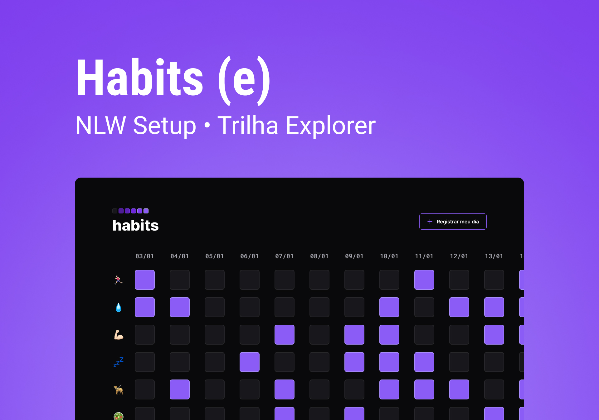

<h1 align="center">habits</h1>

NLW é um 
evento esclusivo e gratuito, promovido pela Rocketseat para ensino de tecnologias Web. 

## Tecnologias

Esse projecto foi desenvolvido com as seguintes tecnologias: 
-HTML e Css 
-JavaScript 
-Git e GitHub 
-Figma 

## projecto
O projecto Habits é um app para ajudar a colocar os hábitos.

 ## layout
  podes visualizar o layout do projecto atraves [DESSE LINK]{https://www.figma.com/file/se9UsjQaVVn8RZnVWW1Lny/Habits-(e)-(Community)?node-id=6%3A910&t=Q6W11dJOwCJfutHA-0}. É NECESSARIO ter uma conta no [Figma] para acessá-lo.
  

